# 00 — Configuration de Proxmox et Création de la VM

## Objectif
Préparer le nœud Proxmox Virtual Environment (PVE) pour accueillir l'infrastructure `NOVA_CORP`, configurer le réseau virtuel (Bridge) et créer la première machine virtuelle (DC1).

---

## 1. Préparation du Nœud Proxmox

> **Contexte** : Avant de créer des machines virtuelles, il faut s'assurer que Proxmox a accès à Internet pour télécharger les images ISO nécessaires (Windows Server, pilotes VirtIO).

### Test de connectivité
Se connecter en SSH ou via le shell web de Proxmox et vérifier l'accès Internet :
```bash
ping google.com
```
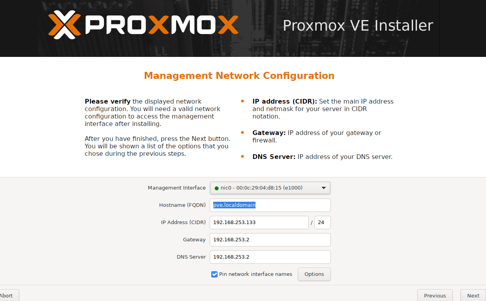

### Téléchargement des ISOs
Naviguer dans le dossier de stockage des ISOs de Proxmox et télécharger l'image d'évaluation de Windows Server :
```bash
cd /var/lib/vz/template/iso
wget "https://software-download.microsoft.com/download/pr/..." -O WindowsServer2022.iso
```
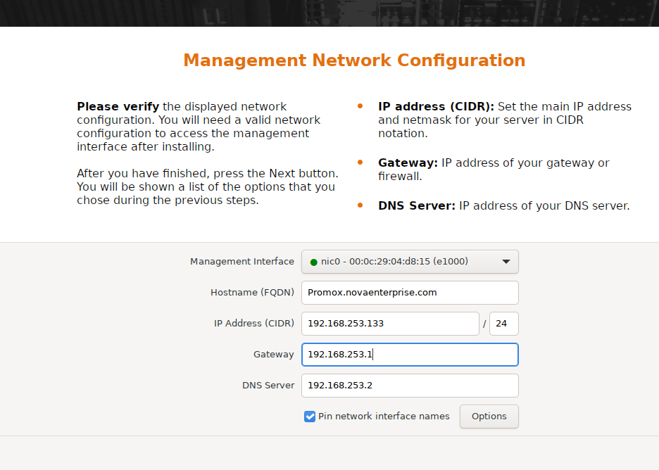
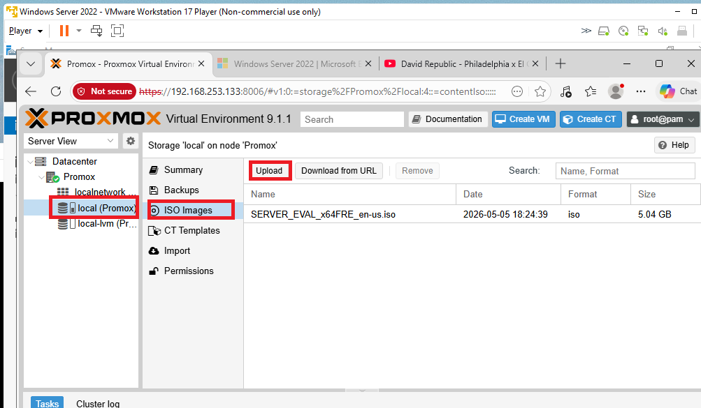
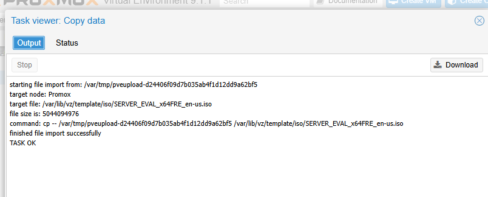

---

## 2. Configuration Réseau Proxmox (Bridge vmbr0)

> **Contexte** : Les machines virtuelles communiquent avec le réseau physique via un commutateur virtuel, appelé "Linux Bridge" sous Proxmox. Nous utilisons `vmbr0`.

### Configuration via CLI
Editer le fichier de configuration réseau de Proxmox :
```bash
nano /etc/network/interfaces
```
Vérifier que `vmbr0` est bien configuré avec l'IP de management (ex: `192.168.253.133`).
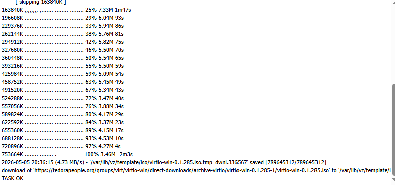
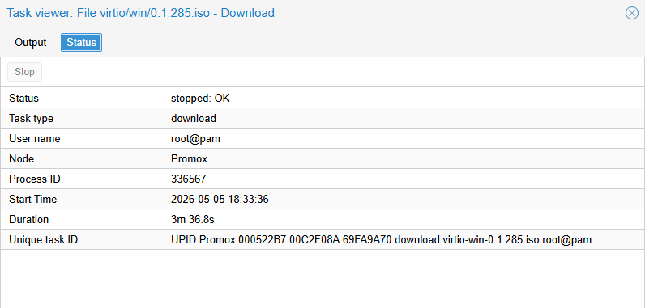

Redémarrer le service réseau pour appliquer les changements :
```bash
systemctl restart networking.service
```
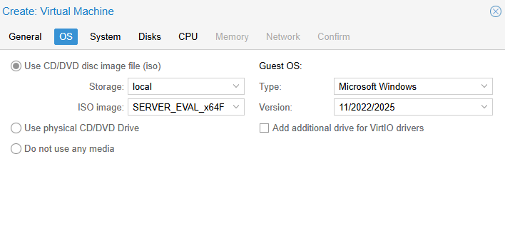

### Dépannage Réseau : Problème de Passerelle (Troubleshooting)
Si les VMs n'ont pas accès à Internet, il se peut que la passerelle réseau physique soit mal configurée sur le Bridge Proxmox. Par exemple, si la passerelle réelle de votre environnement de test est `192.168.253.2` et non `.1`.

Vérification de l'échec depuis une VM :
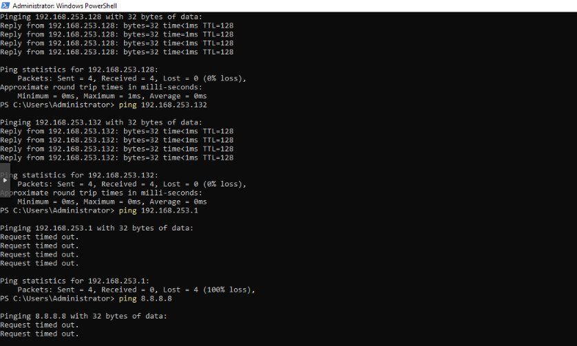
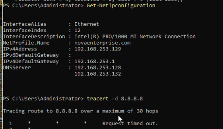

**Correction depuis l'interface Web Proxmox :**
1. Naviguer vers **Nœud (Proxmox) → System → Network**.
2. Éditer l'interface `vmbr0`.
3. Corriger le champ **Gateway (IPv4)** de `192.168.253.1` à `192.168.253.2`.
4. Cliquer sur **Apply Configuration**.

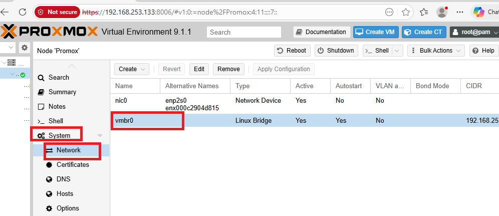
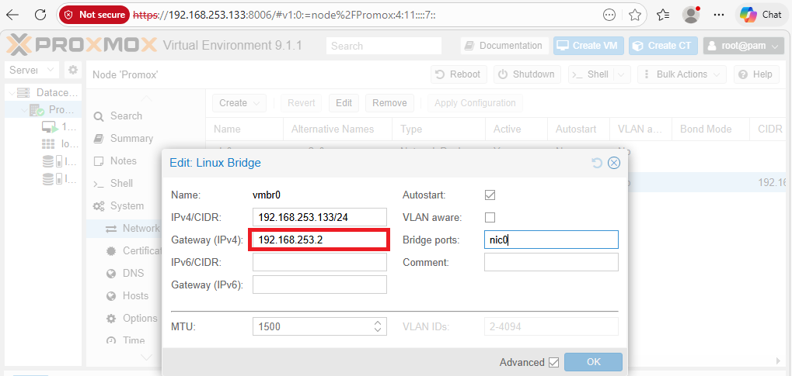
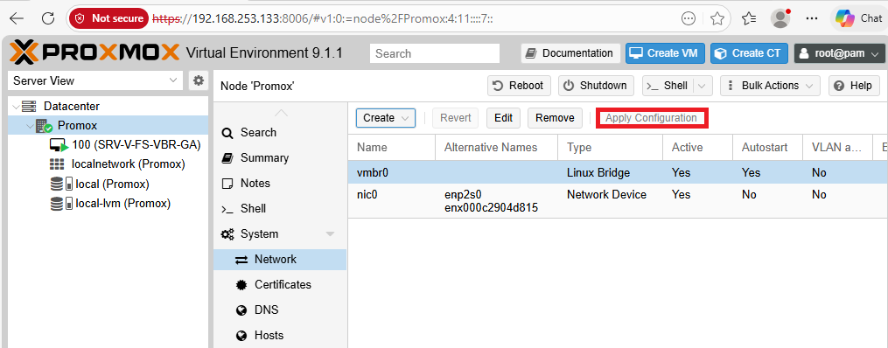

**Correction depuis la VM Windows :**
Une fois le réseau de l'hyperviseur corrigé, mettre à jour la table de routage ou la configuration IP de la machine virtuelle Windows :
```powershell
Remove-NetRoute -NextHop 192.168.253.1 -Confirm:$False
New-NetRoute -DestinationPrefix 0.0.0.0/0 -InterfaceAlias "Ethernet" -NextHop 192.168.253.2
ping 8.8.8.8
```
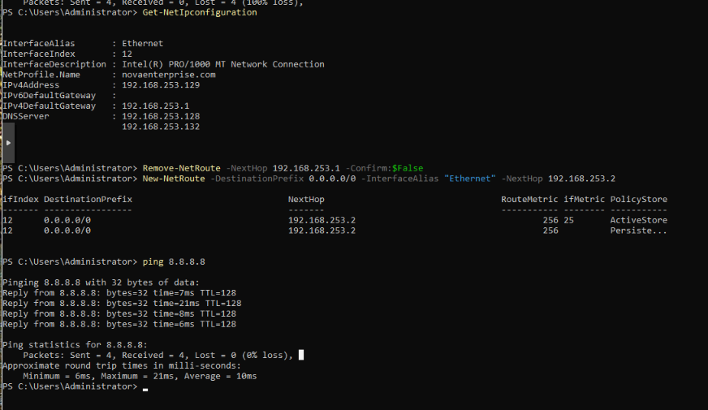

---

## 3. Création de la Machine Virtuelle (Windows Server)

> **Contexte** : Création de la VM principale qui deviendra le premier contrôleur de domaine (DC1). Nous utiliserons des pilotes VirtIO pour optimiser les performances de stockage et réseau.

1. **General** : Définir le nom de la VM.
   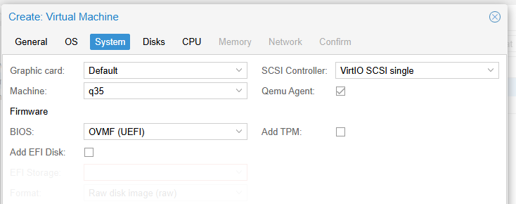

2. **OS** : Sélectionner l'ISO de Windows Server précédemment téléchargé.
   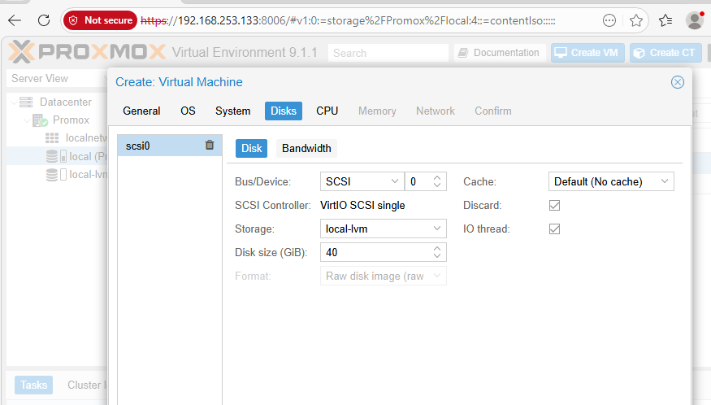

3. **System** : Conserver les valeurs par défaut (Carte graphique par défaut, contrôleur SCSI VirtIO).
   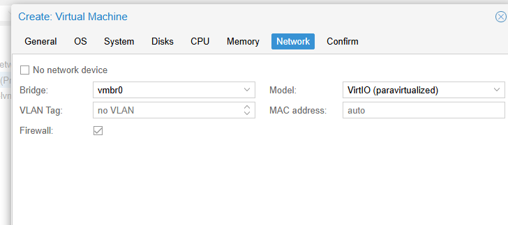

4. **Disks** :
   - Bus/Device : **VirtIO Block** *(Nécessite le montage de l'ISO VirtIO pendant l'installation, voir section 11)*
   - Disk size : **32 GiB** (ou plus selon les besoins).
   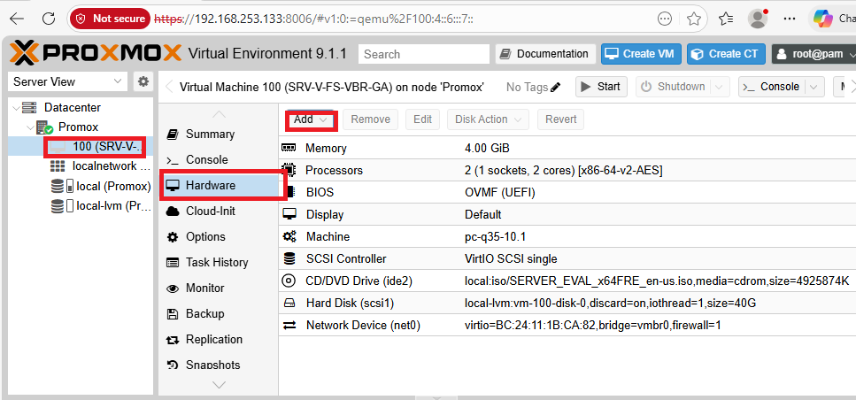

5. **CPU** : Allouer au moins **2 cores**.
   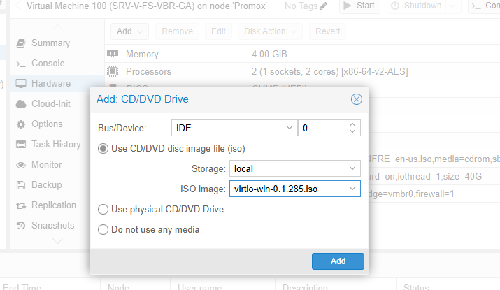

6. **Memory** : Allouer au moins **4096 MiB (4 Go)** de RAM.
   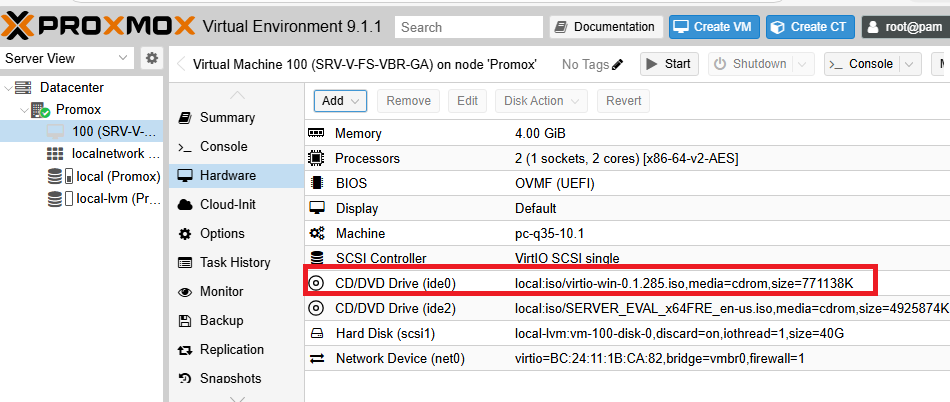

7. **Network** : Attacher la carte réseau virtuelle au bridge `vmbr0` (Modèle Intel E1000 ou VirtIO).
   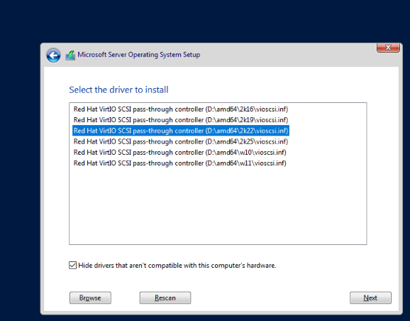

Finaliser la création et démarrer la VM pour procéder à l'installation de Windows Server (se référer à `11-secondary-server-deployment.md` pour le chargement des pilotes VirtIO durant l'installation).

---

## ✅ Validation

- [ ] Connectivité Internet du nœud Proxmox vérifiée
- [ ] Images ISO (Windows Server + VirtIO) disponibles localement
- [ ] Bridge réseau `vmbr0` configuré avec la bonne passerelle
- [ ] Machine Virtuelle créée avec les paramètres optimisés (VirtIO)
- [ ] Routage réseau fonctionnel depuis les VMs vers Internet
