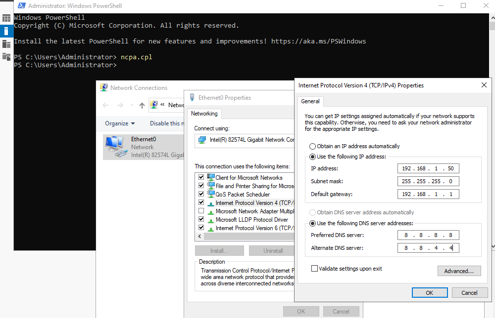
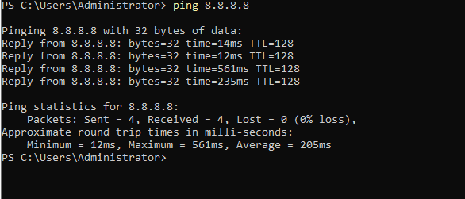
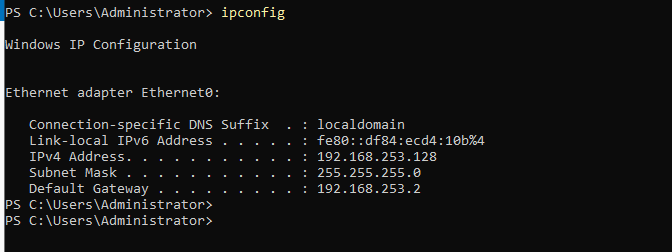
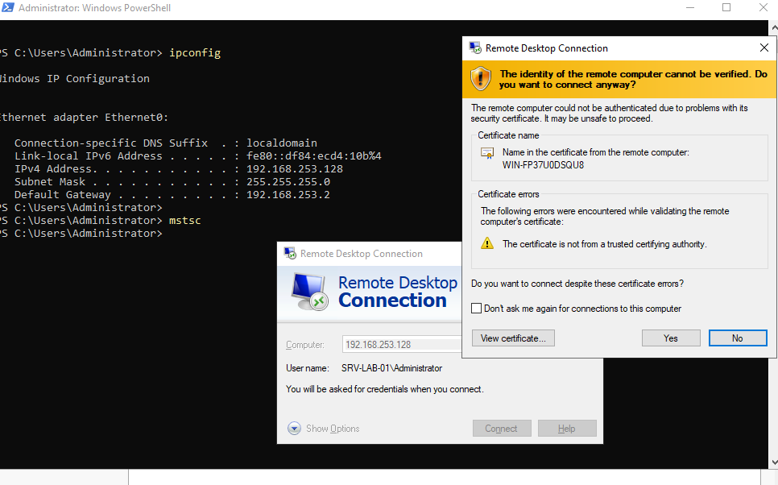
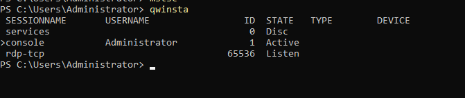
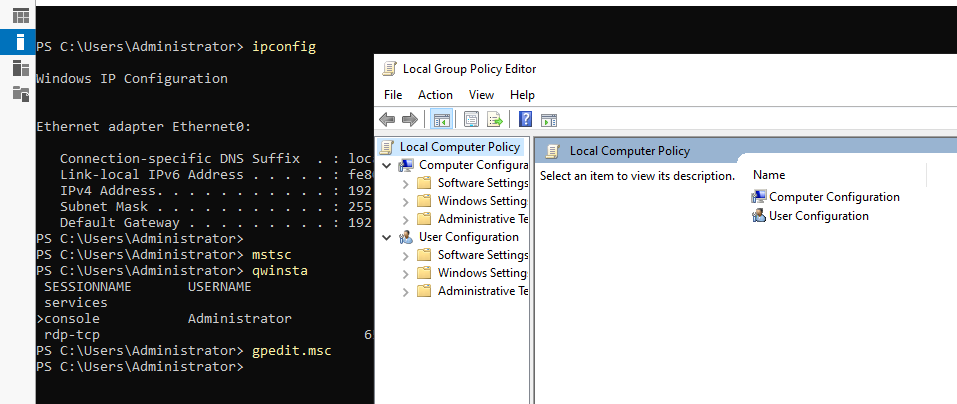
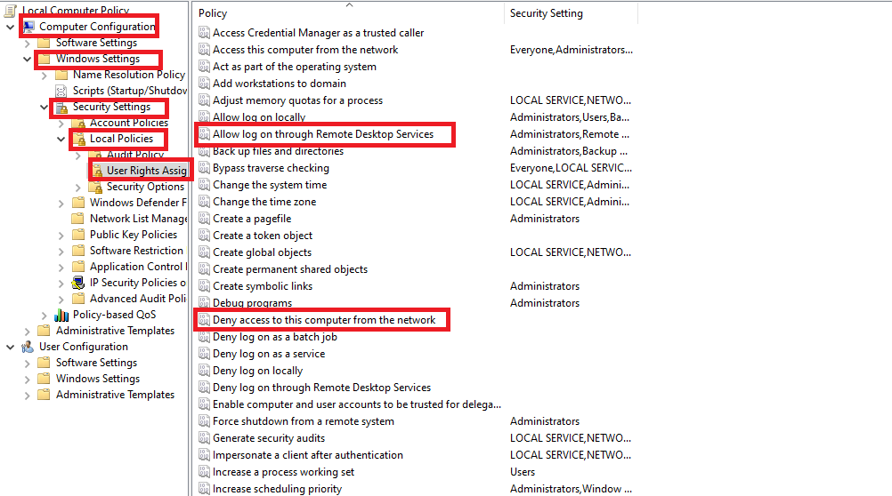
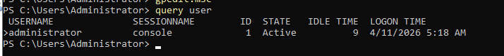

# 01 — Configuration Réseau & Accès RDP

## Objectif
Configurer le réseau du serveur avec une IP statique et sécuriser l'accès RDP.

---

## 1. Configurer l'IP statique sur le serveur

> **Contexte** : Un serveur doit toujours avoir une adresse IP fixe. Si l'IP change (via DHCP), les clients et les autres services ne pourront plus le localiser sur le réseau. Le DC sera également son propre serveur DNS, d'où l'importance de pointer `ServerAddresses` sur lui-même.

Ouvrir PowerShell avec des privilèges d'administration sur le serveur (DC1) :




```powershell
# Voir les interfaces réseau disponibles
Get-NetAdapter

# Définir une IP statique (à adapter selon l'environnement)
New-NetIPAddress -InterfaceAlias "Ethernet" -IPAddress 192.168.253.128 -PrefixLength 24 -DefaultGateway 192.168.253.2

# Définir le serveur DNS (pointer vers le futur DC)
Set-DnsClientServerAddress -InterfaceAlias "Ethernet" -ServerAddresses 192.168.253.128
```

---

## 2. Tester la connectivité

> **Contexte** : Avant de poursuivre l'installation, valider que le serveur peut atteindre la passerelle (routeur) et que la configuration IP est correctement appliquée. Un problème réseau non détecté à ce stade compromet toutes les étapes suivantes.





```powershell
# Tester la connexion réseau
Test-Connection -ComputerName 192.168.253.2 -Count 2

# Vérifier la config IP
ipconfig /all
```

---

## 3. Contrôler l'accès RDP (sécurité)

> **Contexte** : Le Bureau à distance (RDP) est un vecteur d'attaque fréquent. Sur un serveur de production, il est indispensable de vérifier les sessions ouvertes et de restreindre les comptes autorisés à sétablir des connexions distantes.




### Vérifier les sessions actives



```powershell
# Méthode 1
query user

# Méthode 2 (alias)
qwinsta
```

### Activer RDP via PowerShell

```powershell
# Activer le Bureau à distance
Set-ItemProperty -Path 'HKLM:\System\CurrentControlSet\Control\Terminal Server' -Name "fDenyTSConnections" -Value 0

# Autoriser dans le pare-feu
Enable-NetFirewallRule -DisplayGroup "Remote Desktop"
```

> ⚠️ **Sécurité** : Limitez l'accès RDP via GPO à seulement les comptes autorisés. Voir [07-gpo-security.md](07-gpo-security.md).

## 4. Configuration des Exclusions DHCP

> **Contexte** : Comme une plage large a été créée pour le réseau local (ex: `.1` à `.254`), il est impératif d'ajouter des exclusions pour les adresses IP statiques afin d'éviter les conflits d'adresses.

Assurez-vous d'exclure les adresses suivantes de votre serveur DHCP (routeur ou serveur) :
- **Serveurs de l'infrastructure** (ex: `192.168.253.128`)
- **Passerelle / Gateway** (ex: `192.168.253.2`)

> 💡 **Note** : Voir le document [12-dhcp-configuration.md](12-dhcp-configuration.md) pour la configuration complète du serveur DHCP sous Windows Server.

---

## ✅ Validation

- [ ] IP statique configurée sur DC1
- [ ] `ping` vers la passerelle fonctionne
- [ ] RDP accessible depuis le réseau local
- [ ] Sessions actives vérifiées avec `query user`
- [ ] Exclusions DHCP configurées pour le serveur et la passerelle
