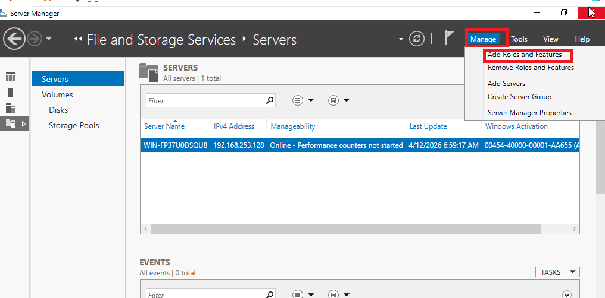
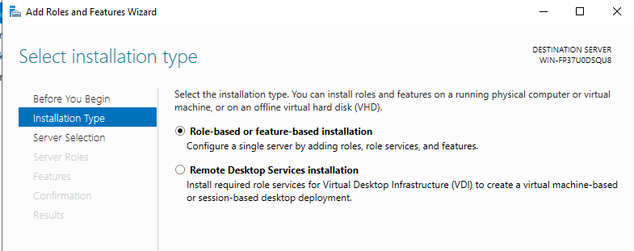
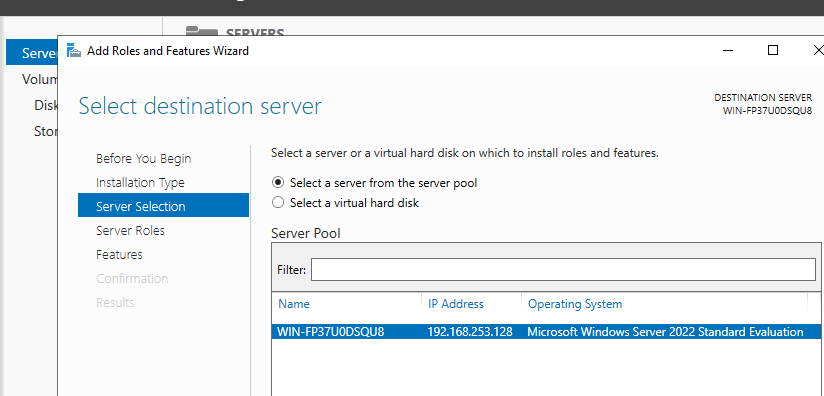
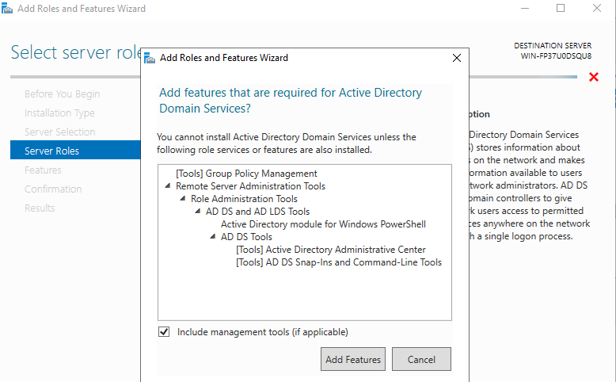
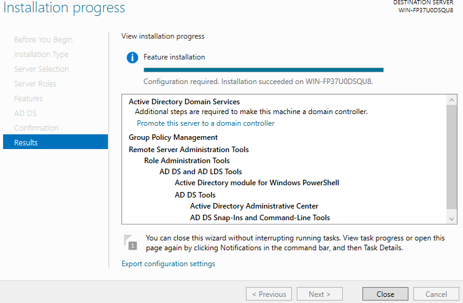
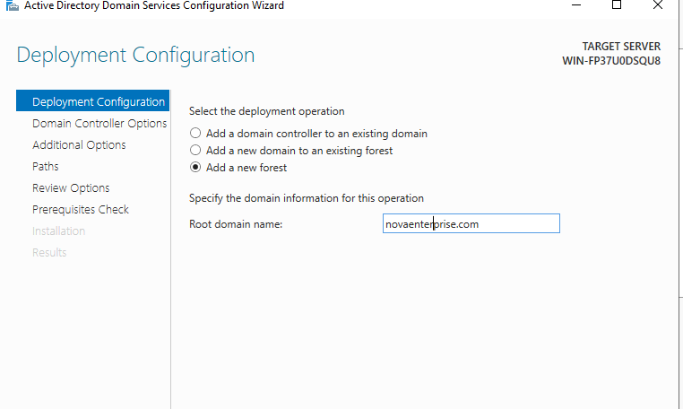
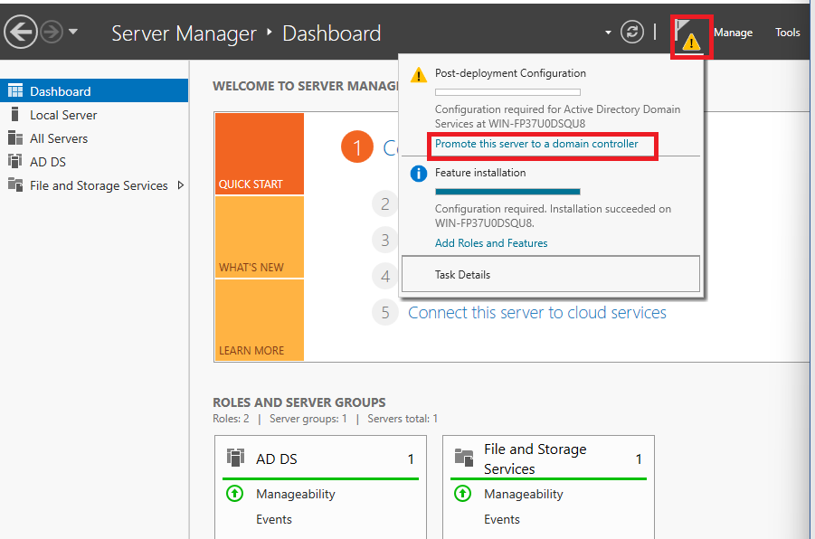
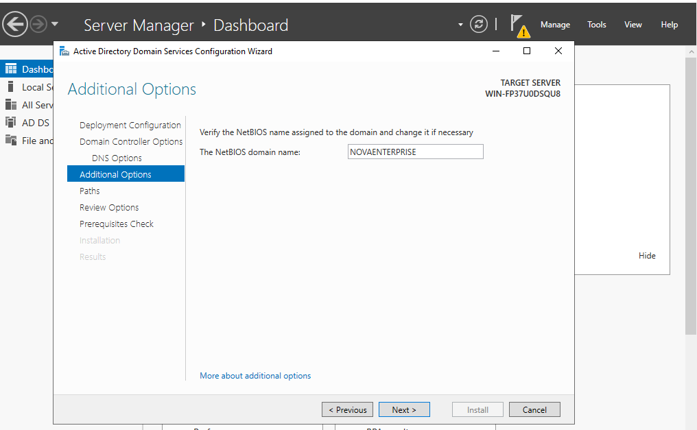

# 02 — Installation AD DS & Promotion en Domain Controller

## Objectif
Installer le rôle Active Directory Domain Services et promouvoir le serveur en Domain Controller (DC) du domaine `novaenterprise.com`.

---

## 1. Installer le rôle AD DS

> **Contexte** : Le rôle **Active Directory Domain Services** transforme un serveur Windows ordinaire en contrôleur de domaine. Sans ce rôle, il est impossible de créer un domaine, de gérer des utilisateurs centralisés ou d'appliquer des GPO. Il s'agit de la brique fondamentale de l'infrastructure.

### Via PowerShell (recommandé)

```powershell
# Installer le rôle AD DS et les outils de gestion
Install-WindowsFeature -Name AD-Domain-Services -IncludeManagementTools

# Vérifier l'installation
Get-WindowsFeature AD-Domain-Services
```

### Via l'interface graphique (Server Manager)
1. Ouvrir le **Server Manager**
2. Cliquer sur **Add Roles and Features**
3. Sélectionner **Active Directory Domain Services**
4. Accepter les dépendances et procéder à l'installation







---

## 2. Promouvoir le serveur en Domain Controller

> **Contexte** : Installer le rôle AD DS ne suffit pas. La promotion via `Install-ADDSForest` crée la **forêt Active Directory**, initialise la base de données NTDS, et configure le DNS intégré. C'est à ce moment que le serveur prend officiellement le rôle de DC.





```powershell
# Créer une nouvelle forêt et promouvoir le serveur en DC
Install-ADDSForest `
    -DomainName "novaenterprise.com" `
    -DomainNetbiosName "NOVAENTERPRISE" `
    -ForestMode "WinThreshold" `
    -DomainMode "WinThreshold" `
    -InstallDns:$true `
    -Force:$true
```

> Remarque : Le serveur redémarrera automatiquement après la promotion.

---

## 3. Vérifier la promotion

> **Contexte** : Après redémarrage, vérifier que les services critiques du DC sont actifs (`ADWS`, `KDC`, `Netlogon`). Un DC dont le service `Netlogon` ne démarre pas ne peut pas authentifier les utilisateurs du domaine.

Après le redémarrage, se connecter et vérifier l'état des services :

```powershell
# Vérifier que le DC est bien en place
Get-ADDomainController

# Vérifier le domaine
Get-ADDomain

# Vérifier le service AD
Get-Service ADWS, KDC, Netlogon
```

---

## ✅ Validation

- [ ] Rôle AD DS installé sans erreur
- [ ] Serveur promu en DC du domaine `novaenterprise.com`
- [ ] DNS intégré fonctionnel (`nslookup novaenterprise.com`)
- [ ] Connexion possible avec `NOVAENTERPRISE\Administrator`
