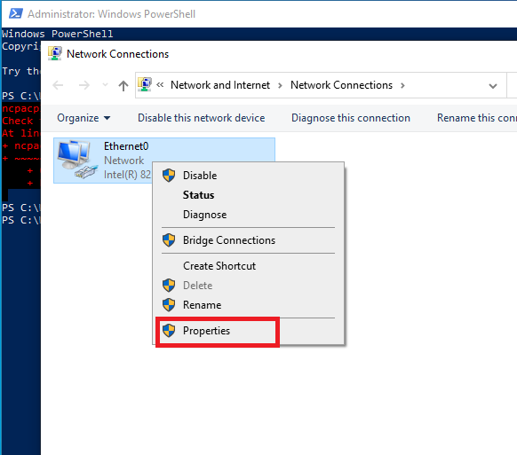
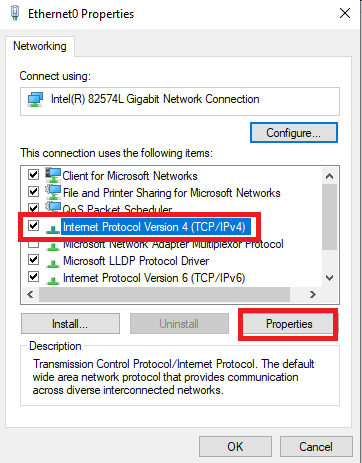
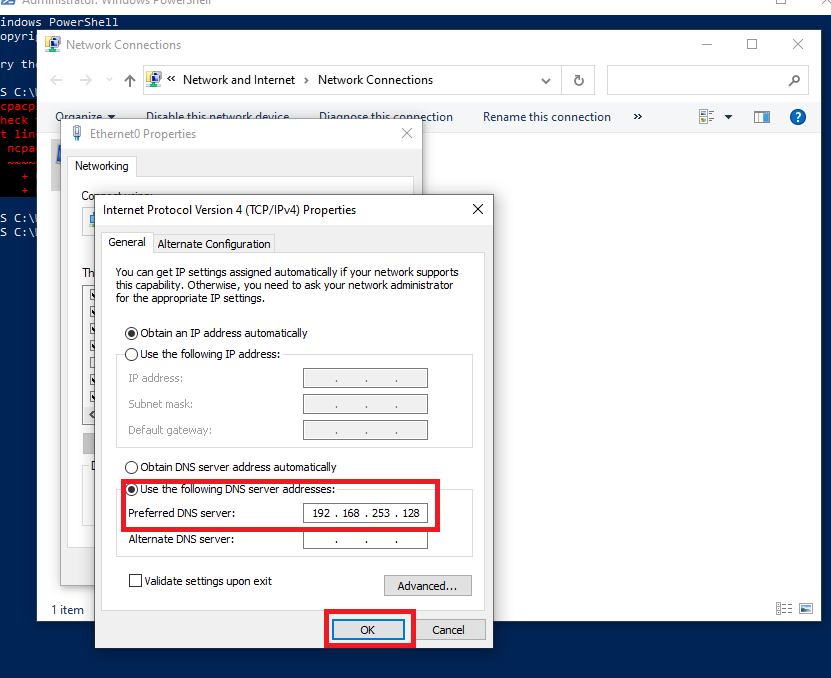

# 03 — Configuration DNS côté Client

## Objectif
Pointer le DNS du PC client vers le Domain Controller pour qu'il puisse résoudre le domaine `novaenterprise.com`.

---

## Concept

> Attention : Le client Windows ne pourra pas résoudre le domaine `novaenterprise.com` s'il n'interroge pas le contrôleur de domaine (DC).

Par défaut, un poste client utilise le DNS du routeur local, lequel ignore l'existence de `novaenterprise.com`. Il est nécessaire de le rediriger vers l'adresse IP du DC (`192.168.253.128`).

---

## Méthode 1 — Interface graphique

> **Contexte** : La modification du DNS via l'interface graphique est immédiate et ne nécessite pas de privilèges PowerShell. Elle est préférable pour une configuration unique sur un seul poste.

1. Exécuter `ncpa.cpl` (Windows + R).
2. Effectuer un clic droit sur la carte réseau (Ethernet) → **Propriétés**.
3. Double-cliquer sur **Internet Protocol Version 4 (IPv4)**.
4. Sélectionner **"Use the following DNS server addresses"**.
5. Dans le champ **Preferred DNS server**, renseigner l'adresse IP du DC : `192.168.253.128`.
6. Valider en cliquant sur **OK**.





---

## Méthode 2 — PowerShell (recommandé)

> **Contexte** : La méthode PowerShell est reproductible et scriptable. Elle est préférable dans un contexte de déploiement de masse où plusieurs postes doivent être configurés rapidement.

```powershell
# Trouver le nom de l'interface réseau
Get-NetAdapter

# Définir le DNS vers le DC
Set-DnsClientServerAddress -InterfaceAlias "Ethernet" -ServerAddresses "192.168.253.128"

# Vérifier
Get-DnsClientServerAddress -InterfaceAlias "Ethernet"
```

---

## Vérifier la résolution DNS

> **Contexte** : `nslookup` est l'outil standard pour valider qu'un serveur DNS résout correctement un nom de domaine. Si la réponse ne provient pas de `192.168.253.128`, la jonction au domaine échouera.

```powershell
# Tester la résolution du domaine
nslookup novaenterprise.com

# Résultat attendu :
# Server:  DC1.novaenterprise.com
# Address: 192.168.253.128
# Name:    novaenterprise.com
```

---

## ✅ Validation

- [ ] DNS du client pointe vers `192.168.253.128`
- [ ] `nslookup novaenterprise.com` résout correctement
- [ ] `ping novaenterprise.com` fonctionne
