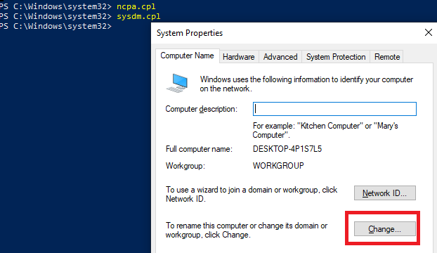
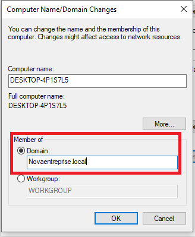
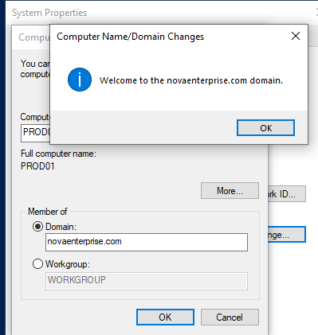

# 04 — Jonction au Domaine NovaEnterprise

## Objectif
Joindre le PC client (CL1) au domaine `novaenterprise.com`.

---

## Prérequis
- ✅ DNS du client configuré vers le DC (voir [03-dns-client-config.md](03-dns-client-config.md))
- ✅ Connexion réseau entre le client et le serveur
- ✅ Identifiants d'un compte administrateur du domaine

---

## Méthode 1 — Interface graphique

> **Contexte** : La jonction graphique via `sysdm.cpl` est la méthode classique. Elle est interactive et guide l'opérateur à chaque étape. Adaptée pour joindre un seul poste manuellement.

1. Lancer `sysdm.cpl` via l'invite Exécuter (Windows + R).
2. Se rendre dans l'onglet **Computer Name** et cliquer sur **Change...**.
3. Dans la section **Member of**, sélectionner **Domain**.
4. Saisir le nom de domaine : `novaenterprise.com`.
5. Valider avec **OK**.
6. Saisir les identifiants d'administration : `NOVAENTERPRISE\Administrator` et le mot de passe associé.
7. Redémarrer le poste client.





---

## Méthode 2 — PowerShell

> **Contexte** : `Add-Computer` permet de joindre un domaine et de redémarrer en une seule commande. Indispensable dans un scénario déploiement automatisé (script de post-installation, MDT, Sysprep).

```powershell
# Joindre le domaine et redémarrer automatiquement
Add-Computer -DomainName "novaenterprise.com" -Credential (Get-Credential) -Restart -Force
```

---

## Vérifier la jonction

> **Contexte** : La commande `Get-WmiObject Win32_ComputerSystem` retourne le domaine auquel appartient la machine. C'est la vérification la plus directe avant d'essayer une connexion avec un compte du domaine.

```powershell
# Vérifier l'appartenance au domaine
(Get-WmiObject Win32_ComputerSystem).Domain
# Résultat attendu : novaenterprise.com

# Ou via systeminfo
systeminfo | findstr /i "domain"
```

---

## Post-jonction

> **Contexte** : Par défaut, Windows place les ordinateurs joints dans le conteneur `Computers` (pas une OU). Ce conteneur ne supporte pas les GPO. Il est impératif de déplacer l'objet vers la bonne OU pour que les politiques s'appliquent correctement.

1. Se connecter avec un compte appartenant au domaine : `NOVAENTERPRISE\csomkwe`.
2. Vérifier depuis le composant **Active Directory Users and Computers** (sur le DC) que l'objet ordinateur est présent dans le conteneur par défaut `Computers`.
3. Déplacer l'objet ordinateur vers l'OU correspondante : `NOVA_CORP > OU_Computers > WKS_Desktops` (consulter [06-ou-structure.md](06-ou-structure.md)).

---

## ✅ Validation

- [ ] PC joint au domaine `novaenterprise.com`
- [ ] Connexion avec compte domaine réussie
- [ ] Machine visible dans AD Users and Computers
- [ ] Machine déplacée dans la bonne OU
