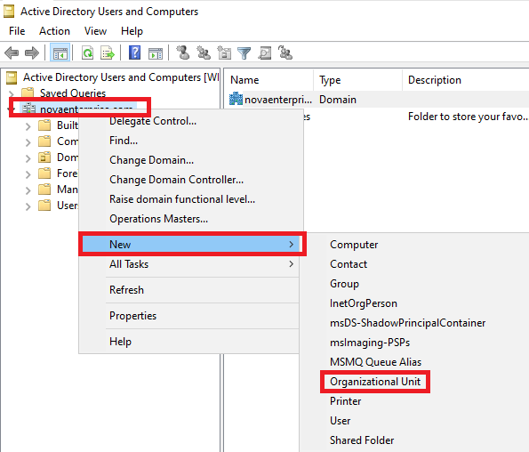
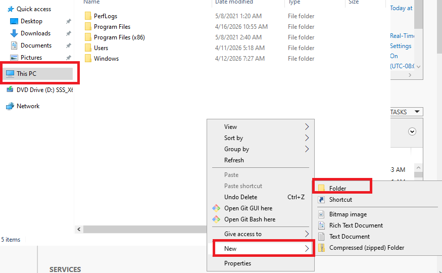
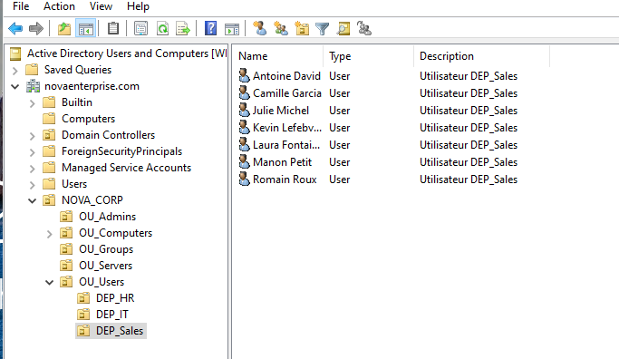

# 06 — Structure OU de l'Entreprise (Unités d'Organisation)

## Objectif
Créer une structure d'Unités d'Organisation (OU) professionnelle pour l'entreprise NovaEnterprise. Ne rien laisser dans les conteneurs par défaut (`Users` et `Computers`).

---

## Pourquoi des OUs ?

> Les dossiers par défaut `Users` et `Computers` sont des **Containers**, pas des OUs. On ne peut pas y appliquer de GPO directement. Il faut créer des OUs pour une vraie gestion d'entreprise.

---

## Structure cible

```
novaenterprise.com
└── NOVA_CORP                    ← OU racine de l'entreprise
    ├── OU_Admins                ← Comptes administrateurs avec privilèges
    ├── OU_Users                 ← Employés standards
    │   ├── DEP_IT               ← Département Informatique
    │   ├── DEP_Sales            ← Département Commercial
    │   └── DEP_HR               ← Ressources Humaines
    ├── OU_Groups                ← Groupes de sécurité et distribution
    ├── OU_Computers             ← Postes de travail
    │   ├── WKS_Desktops         ← Ordinateurs de bureau
    │   └── WKS_Laptops          ← Laptops
    └── OU_Servers               ← Serveurs membres
```

---

## Méthode 1 — Interface graphique

> **Contexte** : La création manuelle est conseillée la première fois pour bien visualiser la hiérarchie dans `dsa.msc`. Elle aide à comprendre graphiquement comment les OUs s'emboîtent dans le domaine.

1. Démarrer la console **Active Directory Users and Computers** (`dsa.msc`).
2. Effectuer un clic droit sur le nom de domaine `novaenterprise.com` → **New → Organizational Unit**.
3. Renseigner le nom : `NOVA_CORP` *(maintenir cochée l'option "Protect container from accidental deletion")*.
4. Répéter l'opération pour la création des sous-unités d'organisation.




---

## Méthode 2 — PowerShell automatisé

> **Contexte** : Le script `New-OUStructure.ps1` reproduit en quelques secondes la même structure que la méthode graphique. C'est la méthode à privilégier en production ou pour un redéploiement rapide après une réinstallation du DC.

> 📄 Script complet disponible : [`scripts/New-OUStructure.ps1`](../scripts/New-OUStructure.ps1)

```powershell
# Exécution rapide
.\scripts\New-OUStructure.ps1
```



---

## Créer l'utilisateur csomkwe

> **Contexte** : La création d'un compte nominatif dans `OU_Users` (et non dans le conteneur par défaut `Users`) simule le processus d'onboarding d'un employé dans un environnement d'entreprise réel.

1. Effectuer un clic droit sur l'OU `OU_Users` → **New → User**.
2. Renseigner les champs obligatoires :
   - **First name** : `Cedric`
   - **Last name** : `Somkwe`
   - **User logon name** : `csomkwe`
3. Cliquer sur **Next**, définir le mot de passe, puis valider avec **Finish**.

```powershell
# Via PowerShell
New-ADUser `
    -GivenName "Cedric" `
    -Surname "Somkwe" `
    -Name "Cedric Somkwe" `
    -SamAccountName "csomkwe" `
    -UserPrincipalName "csomkwe@novaenterprise.com" `
    -Path "OU=OU_Users,OU=NOVA_CORP,DC=novaenterprise,DC=com" `
    -AccountPassword (ConvertTo-SecureString "P@ssword123!" -AsPlainText -Force) `
    -Enabled $true
```

---

## Déplacer le PC client dans la bonne OU

> **Contexte** : Un ordinateur placé dans le conteneur `Computers` par défaut ne recevra pas les GPO liées à `OU_Computers`. Le déplacement est obligatoire pour que les politiques (verrouillage d'écran, restriction USB...) s'appliquent.

1. Dans `dsa.msc`, sélectionner le conteneur par défaut **Computers**.
2. Clic droit sur `CL1` → **Move...**
3. Chemin d'arrivée : `NOVA_CORP → OU_Computers → WKS_Desktops`

```powershell
# Via PowerShell
Get-ADComputer -Identity "CL1" | Move-ADObject -TargetPath "OU=WKS_Desktops,OU=OU_Computers,OU=NOVA_CORP,DC=novaenterprise,DC=com"
```

---

## ✅ Validation

- [ ] OU `NOVA_CORP` créée à la racine du domaine
- [ ] Toutes les sous-OUs créées
- [ ] Utilisateur `csomkwe` dans `OU_Users`
- [ ] PC `CL1` déplacé dans `OU_Computers\WKS_Desktops`
- [ ] Aucun objet laissé dans `Computers` ou `Users` par défaut
