# 07 — Gestion de la Sécurité via GPO

## Objectif
Utiliser les Group Policy Objects (GPO) pour restreindre et sécuriser l'accès au serveur et aux ressources de l'entreprise.

---

## Prérequis
- RSAT: Group Policy Management installé (voir [05-rsat-tools.md](05-rsat-tools.md))
- Accès à la console GPMC

---

## Ouvrir la console GPO

> **Contexte** : La console **GPMC** (`gpmc.msc`) est le point d'entrée central pour créer, lier et gérer toutes les stratégies de groupe. Elle est disponible depuis le poste client via RSAT, sans avoir à se connecter au serveur.

```
Win + R → gpmc.msc → Entrée
```

Ou via PowerShell :
```powershell
gpmc.msc
```

---

## GPO 1 — Restreindre l'accès RDP au serveur

> **Contexte** : Par défaut, tout compte du groupe `Remote Desktop Users` peut se connecter en RDP. Dans un environnement professionnel, cet accès doit être limité aux seuls administrateurs désignés afin de réduire la surface d'attaque.

### Étapes
1. Dans **GPMC**, fais un clic droit sur l'OU cible → **Create a GPO in this domain...**
2. Nom : `SEC-RestrictRDP`
3. Effectuer un clic droit sur la stratégie → **Edit**.
4. Naviguer dans l'arborescence :
   ```
   Computer Configuration
   └── Windows Settings
       └── Security Settings
           └── Local Policies
               └── User Rights Assignment
   ```
5. Double-clique sur **Allow log on through Remote Desktop Services**
6. Ajoute uniquement les groupes autorisés (ex: `G_SEC_IT_Admins`)
7. Retire `Everyone` ou `Remote Desktop Users` si présents

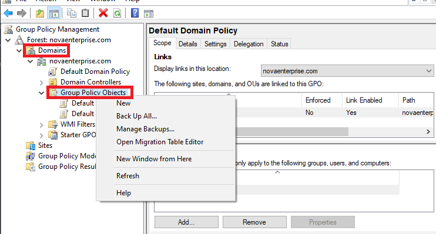
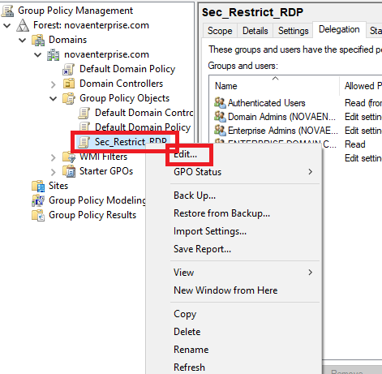
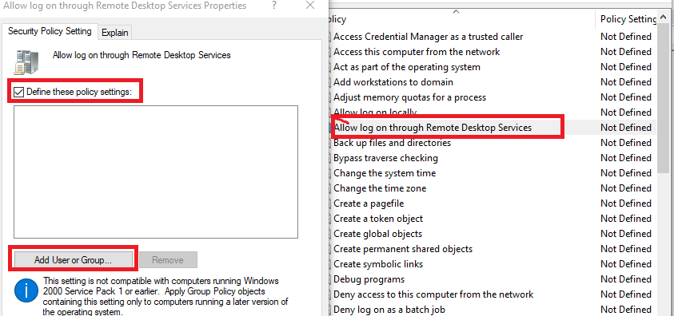
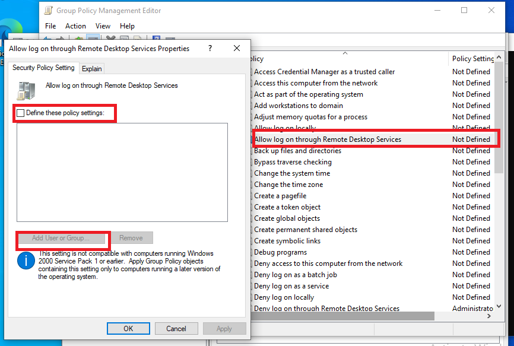
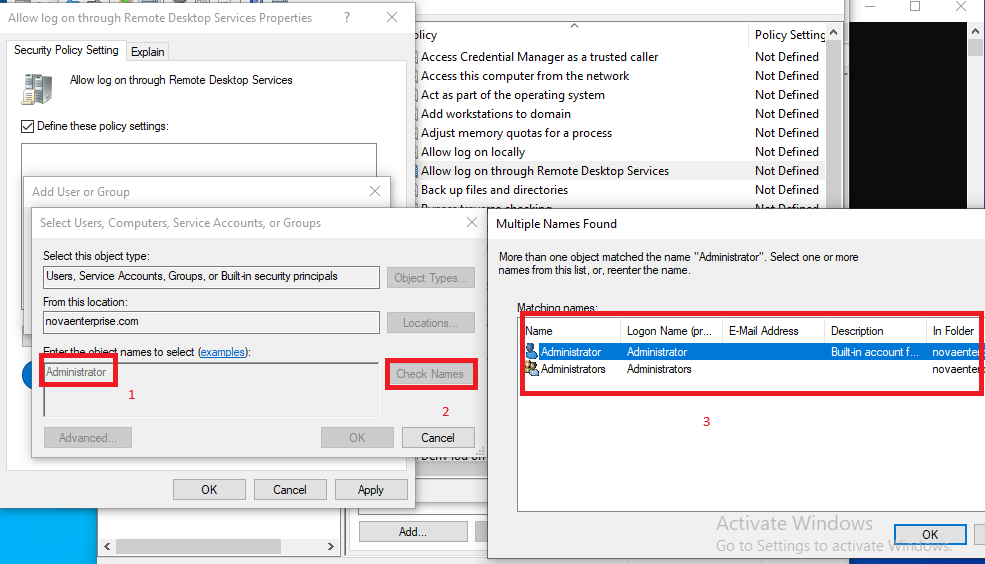

---

## GPO 2 — Politique de mots de passe

> **Contexte** : La politique de mots de passe par défaut de Windows est trop permissive pour un environnement d'entreprise. Cette GPO impose des critères de complexité et une expiration régulière, conformément aux bonnes pratiques (ANSSI, CIS).

1. Générer une nouvelle GPO intitulée `SEC-PasswordPolicy`.
2. Naviguer dans l'arborescence :
   ```
   Computer Configuration
   └── Windows Settings
       └── Security Settings
           └── Account Policies
               └── Password Policy
   ```
3. Paramètres recommandés :

| Paramètre | Valeur recommandée |
|-----------|-------------------|
| Minimum password length | 12 caractères |
| Password must meet complexity | Activé |
| Maximum password age | 90 jours |
| Enforce password history | 10 mots de passe |

---

## Appliquer les GPO

> **Contexte** : Les GPO sont appliquées au démarrage du système ou à l'ouverture de session. `gpupdate /force` permet de forcer l'application immédiate sans attendre le délai de rafraîchissement standard (90 minutes par défaut).

```powershell
# Forcer l'application immédiate sur la machine locale
gpupdate /force

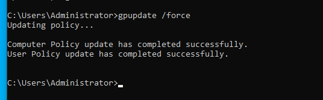

# Appliquer sur une machine distante
Invoke-GPUpdate -Computer "CL1" -Force

# Vérifier les GPO appliquées
gpresult /r
```

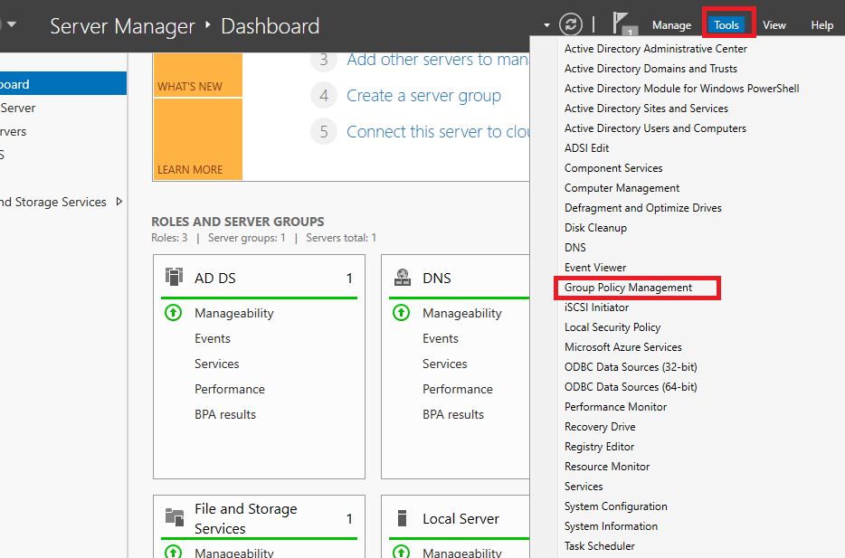
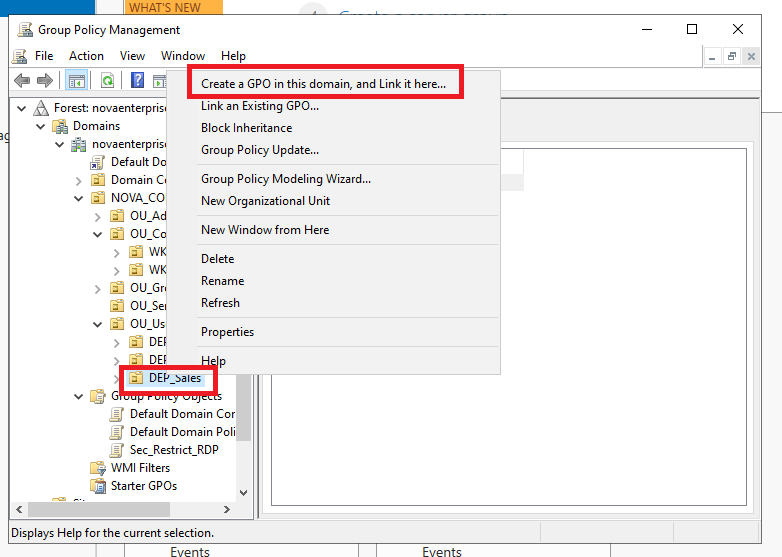
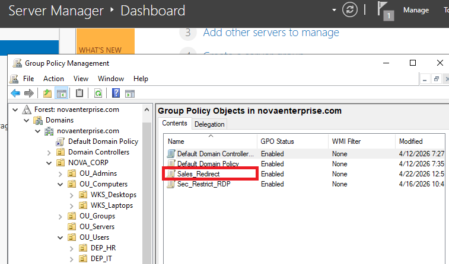
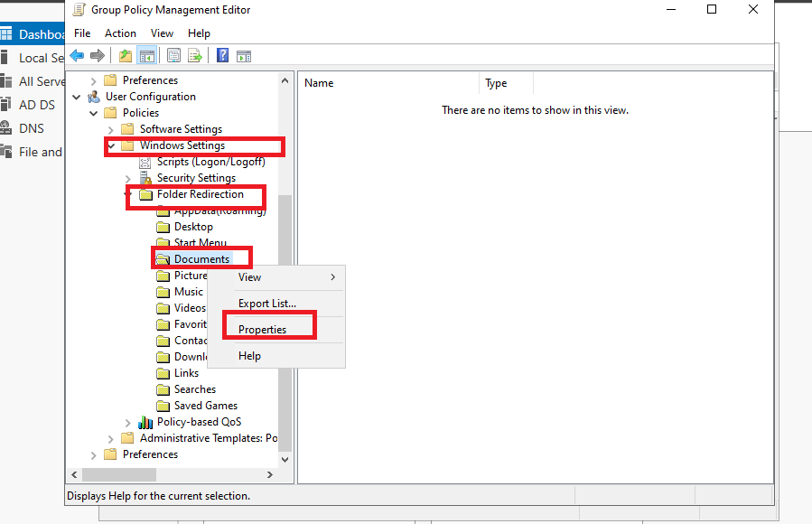
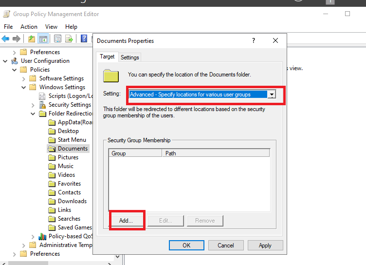
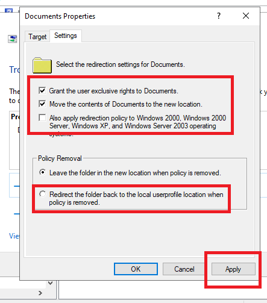

---

## GPO à implémenter (roadmap)

| GPO | Description | Priorité |
|-----|-------------|----------|
| `SEC-RestrictRDP` | Limiter l'accès RDP aux admins IT | 🔴 Haute |
| `SEC-PasswordPolicy` | Politique de mots de passe forte | 🔴 Haute |
| `SEC-DisableUSB` | Désactiver les ports USB sur les postes | 🟡 Moyenne |
| `SEC-ScreenLock` | Verrouillage écran après 10 min | 🟡 Moyenne |
| `SEC-DisableControlPanel` | Bloquer le panneau de config pour les users | 🟢 Basse |
| `SEC-AuditPolicy` | Activer les journaux d'audit | 🟡 Moyenne |

---

## ✅ Validation

- [ ] Console `gpmc.msc` accessible depuis le client
- [ ] GPO `SEC-RestrictRDP` créée et liée
- [ ] GPO `SEC-PasswordPolicy` créée et liée
- [ ] `gpupdate /force` appliqué sans erreur
- [ ] `gpresult /r` confirme les GPO actives
