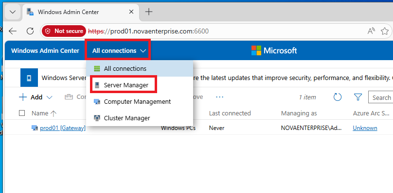
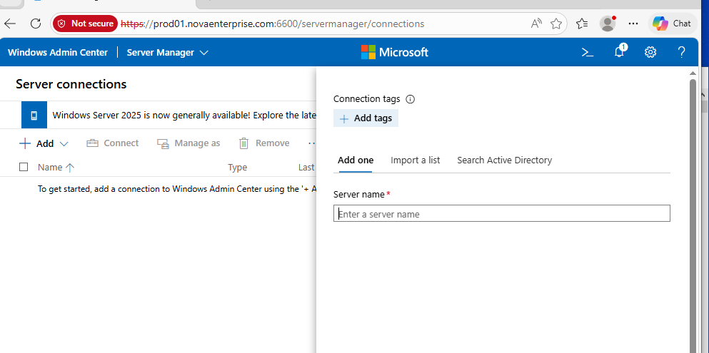
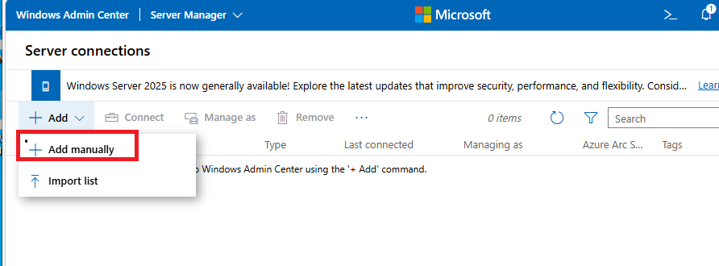

# 08 — Windows Admin Center (WAC)

## Objectif
Installer et configurer Windows Admin Center pour gérer l'infrastructure NOVA_CORP via une interface web moderne.

---

## Qu'est-ce que WAC ?

**Windows Admin Center** est une interface web gratuite de Microsoft pour gérer :
- Les serveurs Windows
- Les clusters Hyper-V
- Active Directory
- Les partages de fichiers
- Et bien plus...

---

## Installation

> **Contexte** : WAC s'installe en mode **gateway** sur le serveur. Tous les postes du réseau peuvent alors le rejoindre via un navigateur, ce qui élimine le besoin d'installer des outils d'administration sur chaque poste client.

### Téléchargement
Télécharger WAC depuis : https://aka.ms/WACDownload

### Installation via PowerShell (sur le serveur DC1)
```powershell
# Installer WAC en mode gateway sur le serveur
msiexec /i WindowsAdminCenter.msi /qn /L*v log.txt SME_PORT=6516 SSL_CERTIFICATE_OPTION=generate
```

### Accès
Accès depuis le navigateur du poste client :
```
https://192.168.253.128:6516
```

---

## Configuration initiale

> **Contexte** : WAC ne gère pas les serveurs automatiquement. Il faut les ajouter manuellement une première fois. Une fois ajouté, le serveur est accessible depuis le tableau de bord avec toutes ses métriques en temps réel.

### A. Ajouter le serveur DC1

1. Sur la page d'accueil, sélectionner **+ Add**.
2. Dans la section **Servers**, cliquer sur **Add**.
3. Renseigner le nom du serveur (ex: `DC1`).
4. Une fois le serveur identifié sur le réseau, valider l'ajout.





### B. Fonctionnalités principales à explorer

| Section | Description |
|---------|-------------|
| Overview | Ressources CPU/RAM en temps réel |
| Events | Journaux d'événements Windows |
| Files | Navigateur de fichiers |
| Firewall | Règles de pare-feu |
| Local Users | Gestion des comptes locaux |
| PowerShell | Terminal PowerShell intégré |
| Roles & Features | Ajout/suppression de rôles |
| Shares | Gestion des partages réseau |

---

## Créer un dossier partagé via WAC

> **Contexte** : WAC propose une alternative graphique à `New-SmbShare`. Cette méthode est plus accessible mais moins automatisée. Consulter [09-shared-folders.md](09-shared-folders.md) pour la version PowerShell complète.

1. Dans WAC, sélectionner le serveur.
2. Naviguer vers **Files & File Sharing → File Shares**.
3. Cliquer sur **+ New Share**.
4. Renseigner :
   - **Share name** : `NOVA_DATA`
   - **Folder path** : `C:\Shares\NOVA_DATA`
5. Configurer les permissions NTFS.

---

## Créer une GPO via WAC

> 🔲 Fonctionnalité en cours d'exploration — voir [07-gpo-security.md](07-gpo-security.md) pour la méthode via GPMC.

---

## ✅ Validation

- [ ] WAC installé et accessible sur `https://192.168.253.128:6516`
- [ ] Serveur DC1 ajouté dans WAC
- [ ] Accès au terminal PowerShell intégré
- [ ] Vue d'ensemble du serveur visible (CPU, RAM, Disk)
