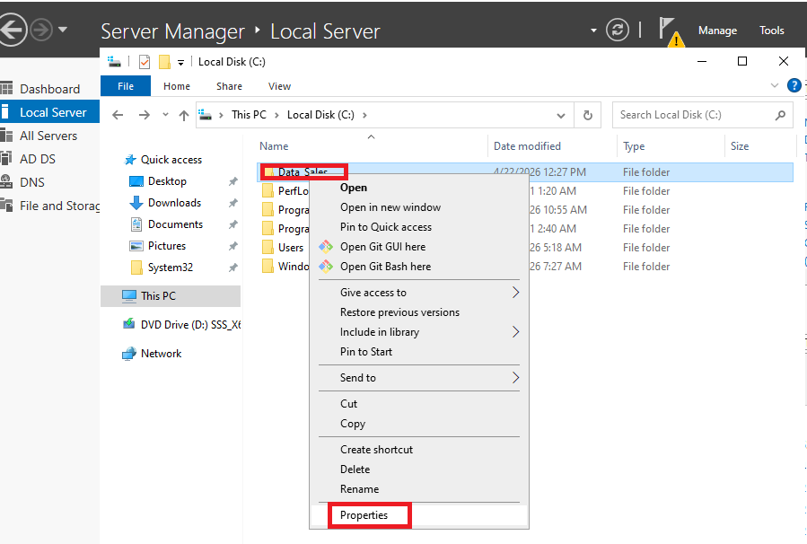
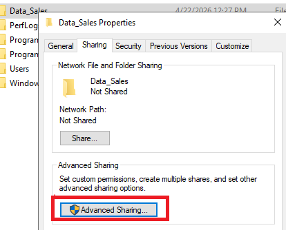
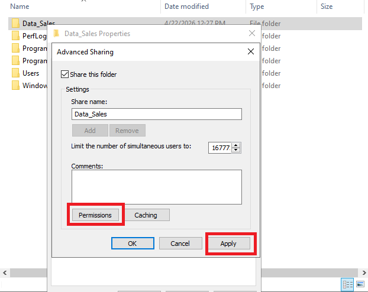
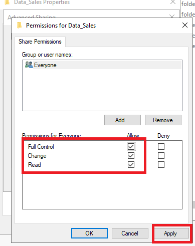
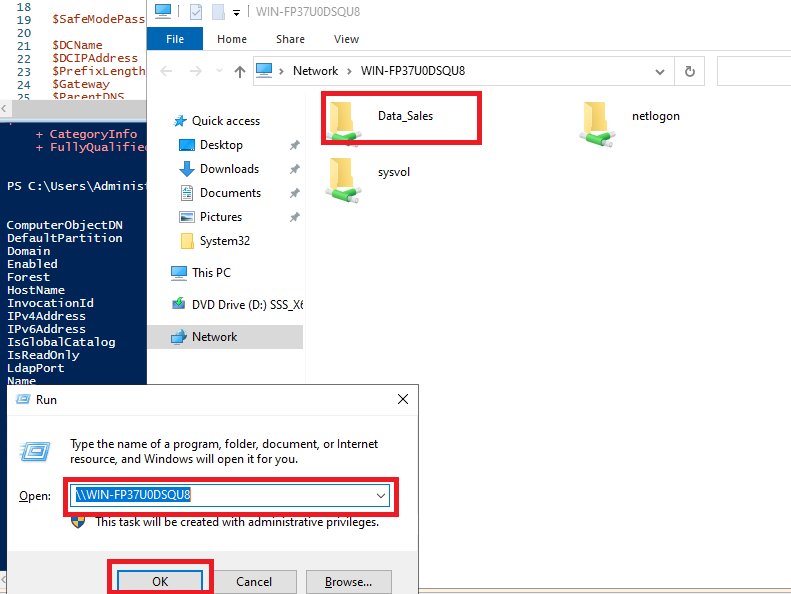

# 09 — Partages de Fichiers & Permissions NTFS

## Objectif

Créer des dossiers partagés sur le serveur DC1, configurer les permissions de partage et NTFS par département, puis mapper les lecteurs réseau via GPO.

---

## Architecture des partages

| Partage      | Chemin local          | Accès                        |
|--------------|-----------------------|------------------------------|
| `NOVA_DATA`  | `C:\Shares\NOVA_DATA` | Tous les utilisateurs (lecture) |
| `IT_SHARE`   | `C:\Shares\IT`        | DEP_IT uniquement            |
| `HR_SHARE`   | `C:\Shares\HR`        | DEP_HR uniquement            |
| `SALES_SHARE`| `C:\Shares\Sales`     | DEP_Sales uniquement         |

---

## 1. Créer les dossiers et partages via PowerShell

```powershell
# Créer les dossiers sur DC1
$shares = @("NOVA_DATA", "IT", "HR", "Sales")
foreach ($s in $shares) {
    New-Item -ItemType Directory -Path "C:\Shares\$s" -Force
}

# Créer les partages réseau
New-SmbShare -Name "NOVA_DATA" -Path "C:\Shares\NOVA_DATA" -ReadAccess  "Everyone"
New-SmbShare -Name "IT_SHARE"  -Path "C:\Shares\IT"        -FullAccess  "NOVAENTERPRISE\DEP_IT"
New-SmbShare -Name "HR_SHARE"  -Path "C:\Shares\HR"        -FullAccess  "NOVAENTERPRISE\DEP_HR"
New-SmbShare -Name "SALES_SHARE" -Path "C:\Shares\Sales"   -FullAccess  "NOVAENTERPRISE\DEP_Sales"

# Vérifier les partages créés
Get-SmbShare | Select-Object Name, Path, Description
```

---

## 2. Configurer les permissions NTFS

```powershell
# Exemple pour le dossier IT : retirer Héritage, puis appliquer des ACL précises
$acl = Get-Acl "C:\Shares\IT"
$acl.SetAccessRuleProtection($true, $false)   # Désactiver l'héritage

# Ajouter les droits au groupe DEP_IT
$rule = New-Object System.Security.AccessControl.FileSystemAccessRule(
    "NOVAENTERPRISE\DEP_IT", "Modify", "ContainerInherit,ObjectInherit", "None", "Allow"
)
$acl.AddAccessRule($rule)
Set-Acl -Path "C:\Shares\IT" -AclObject $acl

# Vérifier les permissions appliquées
(Get-Acl "C:\Shares\IT").Access | Select-Object IdentityReference, FileSystemRights, AccessControlType
```

---

## 3. Mapper les lecteurs réseau via GPO

1. Ouvrir `gpmc.msc`.
2. Créer une GPO nommée `MAP-NetworkDrives` et la lier à `NOVA_CORP`.
3. Naviguer dans l'arborescence :
   ```
   User Configuration
   └── Preferences
       └── Windows Settings
           └── Drive Maps
   ```
4. Clic droit → **New → Mapped Drive**.
5. Renseigner le chemin UNC (ex: `\\DC1\IT_SHARE`) et la lettre de lecteur (ex: `I:`).
6. Utiliser le **ciblage au niveau des éléments (Item-level Targeting)** pour appliquer uniquement aux membres du groupe concerné.







---

## 4. Tester l'accès depuis le client

```powershell
# Tester l'accès au partage depuis CL1
Test-Path "\\DC1\NOVA_DATA"

# Lister le contenu d'un partage
Get-ChildItem "\\DC1\IT_SHARE"

# Forcer la mise à jour des GPO pour mapper les lecteurs
gpupdate /force
```

---

## Validation

- [ ] Dossiers créés sur `C:\Shares\` du DC1
- [ ] Partages SMB visibles dans `Get-SmbShare`
- [ ] Permissions NTFS appliquées par groupe départemental
- [ ] Lecteurs réseau mappés automatiquement après connexion
- [ ] Un compte `DEP_HR` ne peut pas accéder au dossier `IT_SHARE`
