# 11 — Déploiement d'un Serveur Secondaire et Contrôleur de Domaine (DC2)

## Objectif
Déployer un deuxième serveur (`SRV-DC2-NOVA`), le configurer sur le réseau, le joindre au domaine et le promouvoir en tant que second contrôleur de domaine pour assurer la redondance et la haute disponibilité.

---

## 1. Préparation du Serveur (Nom et Réseau)

> **Contexte** : Avant toute intégration, le serveur doit avoir un nom explicite et pointer vers le contrôleur de domaine principal (DC1) pour la résolution DNS.

### 1.1 Renommage du serveur
Le serveur génère un nom aléatoire (ex: `WIN-IRKJ...`). Il faut le renommer.
```powershell
Rename-Computer -NewName "SRV-DC2-NOVA" -Restart
```
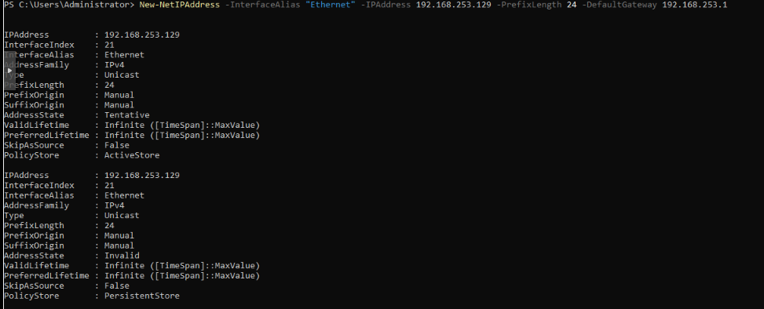

### 1.2 Configuration IP et DNS
Configurer l'adresse IP statique (`192.168.253.132`) et définir le serveur DNS principal vers DC1 (`192.168.253.128`).
```powershell
Set-DnsClientServerAddress -InterfaceAlias "Ethernet0" -ServerAddresses 192.168.253.128
nslookup novaenterprise.com
```
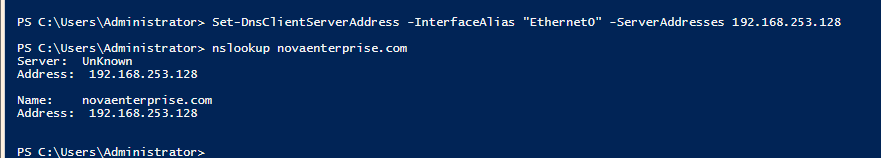

Vérification de la connectivité réseau et IP :
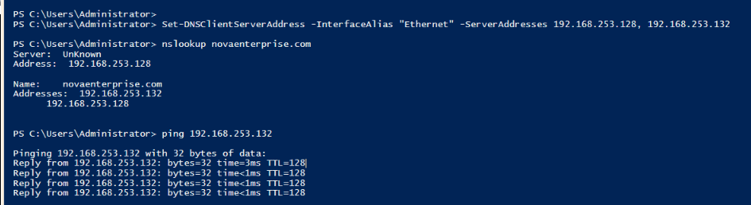
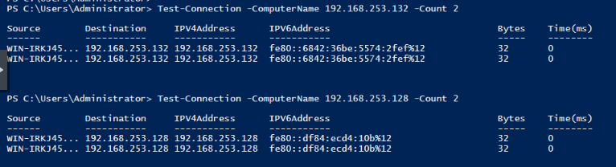

---

## 2. Intégration au Domaine

Vérifier que le domaine est joignable, puis intégrer le serveur.

```powershell
ping novaenterprise.com
Add-Computer -DomainName "novaenterprise.com" -Credential (Get-Credential "NOVAENTERPRISE\Administrator") -Restart
```
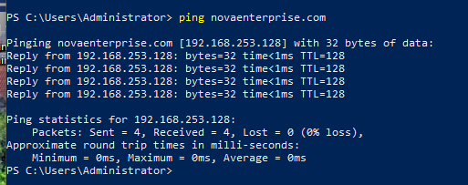

Une fois redémarré, vérifier que le serveur est bien membre du domaine :
```powershell
(Get-WmiObject Win32_ComputerSystem).domain
systeminfo | findstr /i "domain"
```
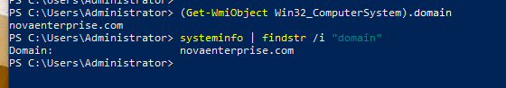

---

## 3. Gestion de l'objet Ordinateur via PowerShell

> **Contexte** : Par défaut, les ordinateurs joints vont dans le conteneur `Computers`. Nous allons utiliser le module ActiveDirectory pour déplacer l'objet vers une OU appropriée avant la promotion.

### Installation du module RSAT-AD-PowerShell
```powershell
Install-WindowsFeature RSAT-AD-PowerShell
```
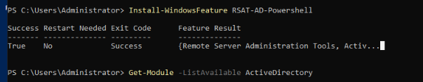

### Déplacement de l'objet
Rechercher l'ordinateur, le déplacer, puis vérifier son nouvel emplacement :
```powershell
# Vérifier l'emplacement actuel
Get-ADComputer -Identity "SRV-DC2-NOVA"

# Déplacer vers l'OU cible
Get-ADComputer -Identity "SRV-DC2-NOVA" | Move-ADObject -TargetPath "OU=OU_Servers,OU=NOVA_CORP,DC=novaenterprise,DC=com"
```
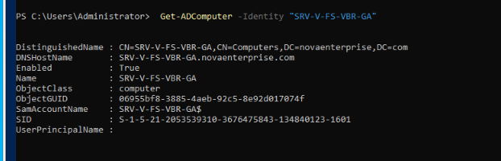
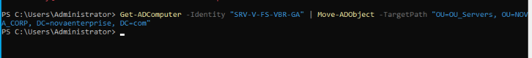
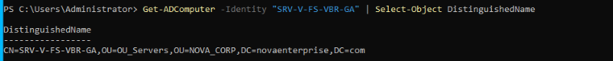

*(Note: Les captures illustrent l'opération sur l'ancien nom généré du serveur, mais la logique reste la même).*

---

## 4. Promotion en Second Contrôleur de Domaine (DC2)

Installer le rôle AD DS et promouvoir le serveur :

```powershell
Install-WindowsFeature -Name AD-Domain-Services -IncludeManagementTools
Install-ADDSDomainController `
    -DomainName "novaenterprise.com" `
    -InstallDns:$true `
    -Credential (Get-Credential "NOVAENTERPRISE\Administrator")
```

---

## 5. Validation de la Réplication

> **Contexte** : La réplication garantit que les deux contrôleurs de domaine (DC1 et DC2) partagent la même base de données Active Directory de manière synchronisée.

### Vérifier le contrôleur de domaine actif
```powershell
nltest /dsgetdc:novaenterprise
```
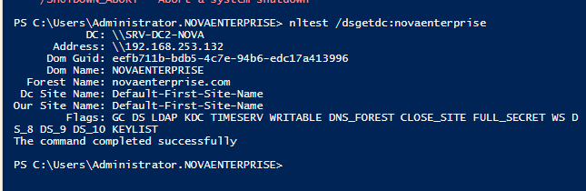

### Vérifier l'état de la réplication
```powershell
repadmin /replsummary
```
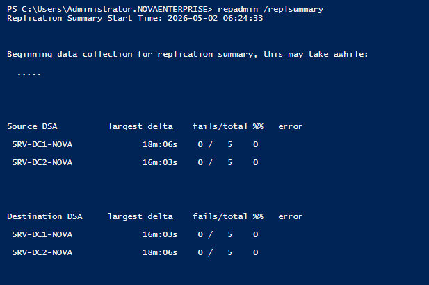

### Identifier les rôles FSMO
```powershell
netdom query fsmo
```
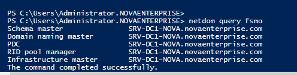

---

## ✅ Validation

- [ ] Serveur renommé en `SRV-DC2-NOVA` avec IP statique
- [ ] Résolution DNS pointant vers DC1 fonctionnelle
- [ ] Serveur intégré au domaine `novaenterprise.com`
- [ ] Objet ordinateur déplacé dans la bonne OU
- [ ] Rôle AD DS installé et promotion effectuée
- [ ] Réplication entre DC1 et DC2 validée sans erreurs (`repadmin /replsummary`)
