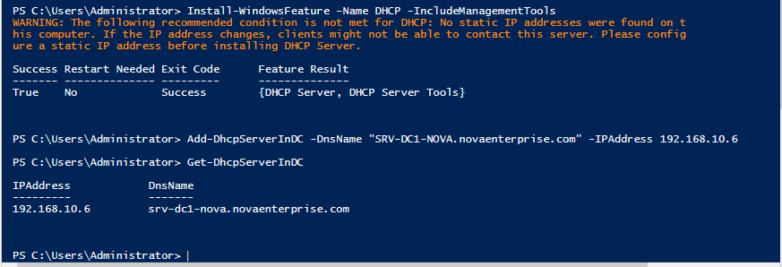
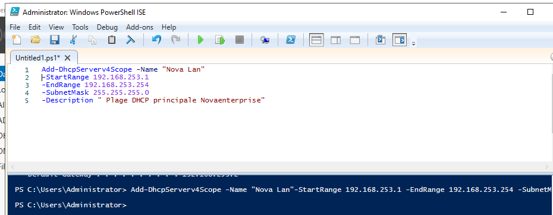
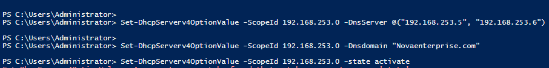
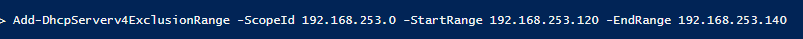
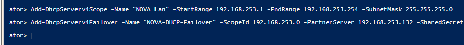

# 12 — Configuration du Serveur DHCP (et Failover)

## Objectif
Installer et configurer le rôle DHCP sur les contrôleurs de domaine pour automatiser l'attribution des adresses IP aux postes clients, puis configurer la haute disponibilité (Failover) entre DC1 et DC2.

---

## 1. Installation du rôle DHCP et Autorisation

> **Contexte** : Dans un environnement Active Directory, un serveur DHCP doit être "autorisé" par l'administrateur de l'entreprise pour pouvoir distribuer des adresses IP. Cela évite l'ajout de serveurs DHCP non légitimes (Rogue DHCP) sur le réseau.

Sur le serveur DC1 (`SRV-DC1-NOVA`) :

```powershell
# 1. Installer le rôle DHCP avec ses outils d'administration
Install-WindowsFeature -Name DHCP -IncludeManagementTools

# 2. Autoriser le serveur DHCP dans l'Active Directory
Add-DhcpServerInDC -DnsName "SRV-DC1-NOVA.novaenterprise.com" -IPAddress 192.168.10.6

# 3. Vérifier l'autorisation
Get-DhcpServerInDC
```

*(Note : L'adresse IP utilisée dans la commande `Add-DhcpServerInDC` doit correspondre à l'adresse réelle de l'interface réseau du serveur)*



---

## 2. Création de l'Étendue (Scope) DHCP

> **Contexte** : L'étendue définit la plage d'adresses IP disponibles pour les clients, ainsi que la durée du bail (Lease).

```powershell
# Créer l'étendue "Nova Lan"
Add-DhcpServerv4Scope -Name "Nova Lan" -StartRange 192.168.253.1 -EndRange 192.168.253.254 -SubnetMask 255.255.255.0 -Description "Plage DHCP principale Novaenterprise"
```



### Vérifier l'étendue créée
```powershell
Get-DhcpServerv4Scope -ScopeId 192.168.253.0
```


---

## 3. Configuration des Options de l'Étendue

> **Contexte** : En plus de l'IP, le serveur DHCP fournit aux clients l'adresse de la passerelle par défaut, les serveurs DNS et le suffixe DNS du domaine pour la résolution de noms.

```powershell
# Définir les serveurs DNS distribués aux clients (Pointer vers les DC)
Set-DhcpServerv4OptionValue -ScopeId 192.168.253.0 -DnsServer @("192.168.253.5", "192.168.253.6")

# Définir le suffixe de domaine
Set-DhcpServerv4OptionValue -ScopeId 192.168.253.0 -DnsDomain "novaenterprise.com"

# Activer l'étendue
Set-DhcpServerv4OptionValue -ScopeId 192.168.253.0 -State Active
```



---

## 4. Ajout d'une Plage d'Exclusion

> **Contexte** : On exclut certaines adresses de la plage de distribution (ex: `192.168.253.120` à `192.168.253.140`) car elles sont réservées pour des équipements à IP statique (serveurs, routeurs, imprimantes).

```powershell
Add-DhcpServerv4ExclusionRange -ScopeId 192.168.253.0 -StartRange 192.168.253.120 -EndRange 192.168.253.140
```



---

## 5. Configuration de la Haute Disponibilité (DHCP Failover)

> **Contexte** : Le Failover DHCP permet à DC2 de prendre le relais si DC1 tombe en panne, garantissant ainsi que les clients continuent de recevoir des adresses IP sans interruption.

Sur DC1, lancer la commande pour configurer le partenariat de basculement avec DC2 (`192.168.253.132` ou le partenaire configuré) :

```powershell
Add-DhcpServerv4Failover -Name "NOVA-DHCP-Failover" -ScopeId 192.168.253.0 -PartnerServer 192.168.253.132 -SharedSecret "NovaSecretKey123!"
```



---

## ✅ Validation

- [ ] Rôle DHCP installé sur le contrôleur de domaine
- [ ] Serveur DHCP autorisé dans l'AD
- [ ] Étendue `Nova Lan` créée et activée
- [ ] Options DHCP (DNS, Domaine) correctement assignées
- [ ] Plage d'exclusion en place pour les serveurs
- [ ] Partenariat Failover DHCP établi et fonctionnel
